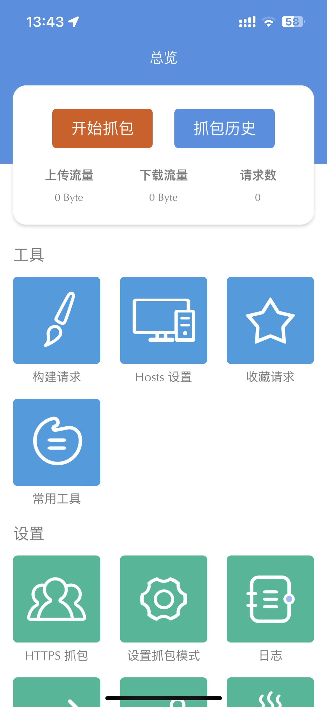
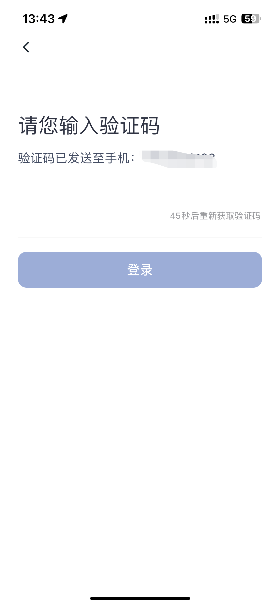
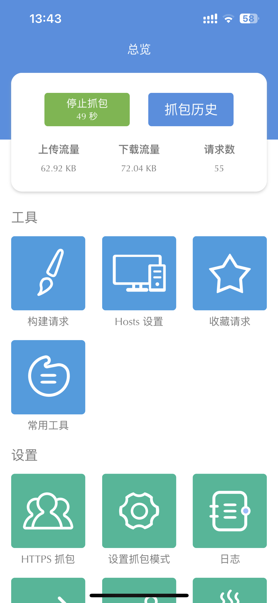
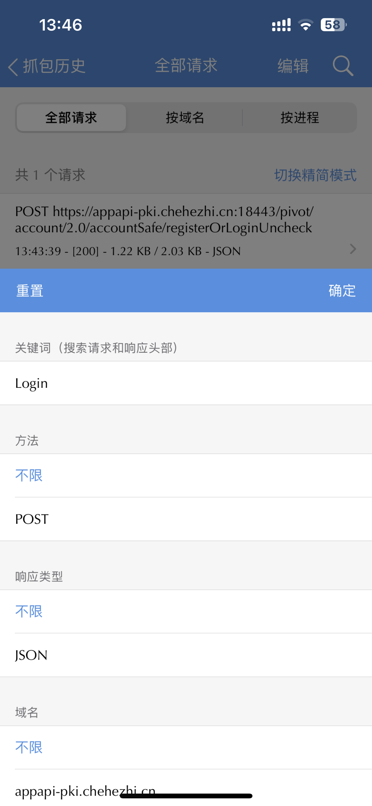
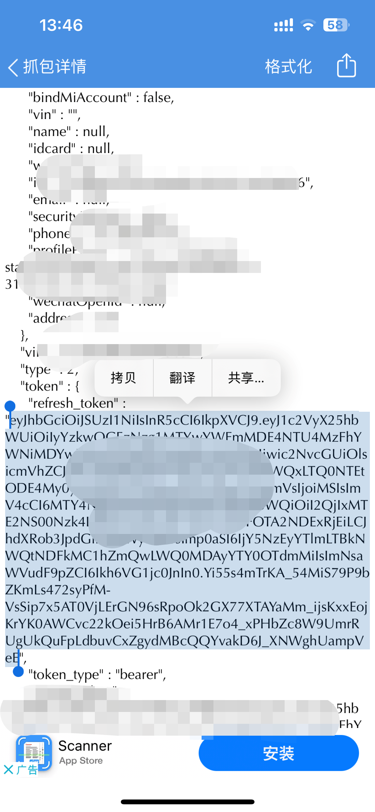
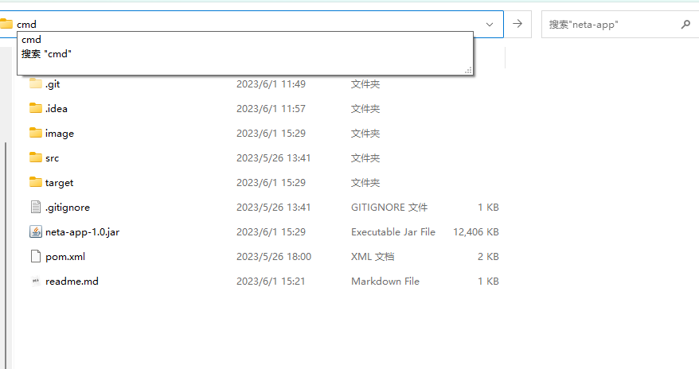
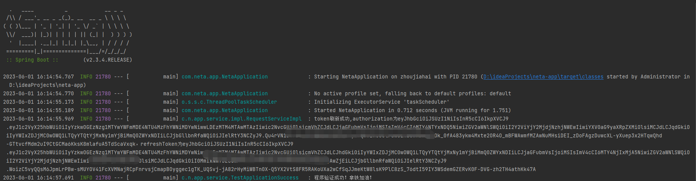

# neta-app

基于Java开发的哪吒汽车APP自动签到，转发文章，评论文章的程序，有兴趣的可以根据里面的请求方法（或者找我捉包的方法也行）去开发别的程序。

也可以代执行脚本，价格为10元/年，链接已经挂咸鱼，或者加我V：Ajar_z


## 使用环境

WIN/MAC

需要安装Java环境，教程参考菜鸟教程

https://www.runoob.com/java/java-environment-setup.html

安装教程这里不赘述

JDK安装成功即代表环境安装成功

## 程序介绍

每天自动签到，评论，转发 获得5+2*3+1*3=14积分（现在评论积分没有了）

程序配置的定时任务为每天早上8点进行

如需要修改，请修改`SchedulingTaskBasic`文件下的cron表达式，然后自行打包

## 使用说明

使用此程序需要用的RefreshToken

token需要用的APP-Stream,自行到商店下载

捉包方法如下：

1. 打开哪吒APP，退出登录，然后打开Stream，点击开始捉包



2. 打开哪吒汽车APP登录，点击发送验证码



3. 登录成功后，打开Stream，点击停止捉包

   

4. 点击捉包历史，点击第一条记录，点击右上角的搜索框，输入Login(注意大小写)，然后确定



5. 点击响应，然后点击查看响应，往下拉会看到有个refresh_token的字段，如图复制，即使程序所需要的token

   

6. 进入到目录，输入cmd，进入命令行界面，输入

   ```
   java -jar neta-app-1.0.jar -REFRESH_TOKEN=xxxxxxxxxxxxxxxxxx
   ```

   xxxx为刚才复制refreshToken





如图所示即为成功

